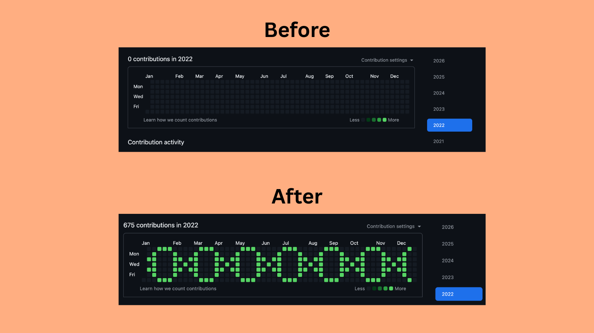

# DNA Double Helix

A DNA double helix painted onto my GitHub contribution graph for **2022**.

Two sine waves intertwine across 52 weeks — crossing over every 8 columns with horizontal base-pair rungs connecting them — forming ~3.25 full rotations of the classic double helix. 680 carefully placed commits, zero actual biology involved.

### See it live

Head to my [GitHub profile (2022 view)](https://github.com/aumvats?tab=overview&from=2022-12-01&to=2022-12-31) and scroll to the contribution graph.
